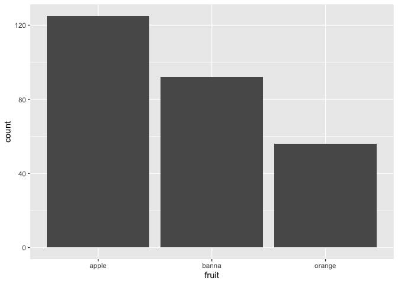

README Demo
================

``` r
library(tidyverse)
```

# Data

This is my readme demo! Here is my data

``` r
fruit <- data.frame(fruit = c("apple", "orange", "banna"),
                    count = c(125, 56, 92))
```

# Plot

Check out this cool plot of fruit!

``` r
ggplot(fruit, aes(x = fruit, y = count)) +
  geom_col()
```

<!-- -->

# Table

Here is a nicely printed table too!

``` r
fruit
```

    ##    fruit count
    ## 1  apple   125
    ## 2 orange    56
    ## 3  banna    92
